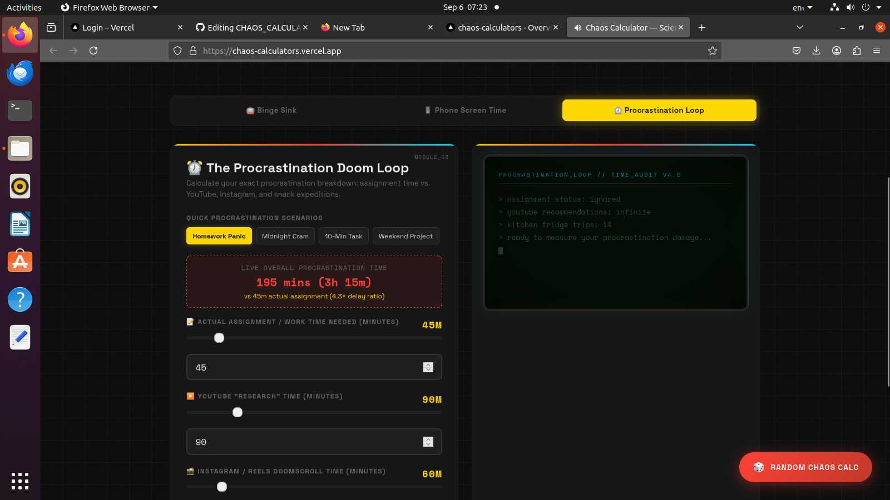
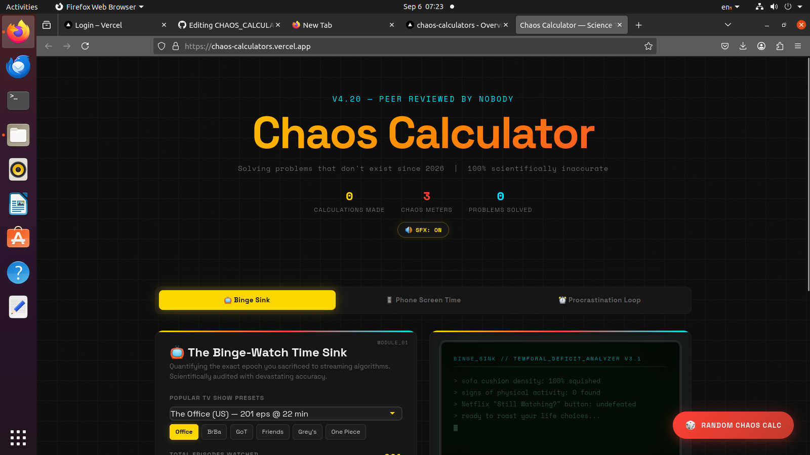
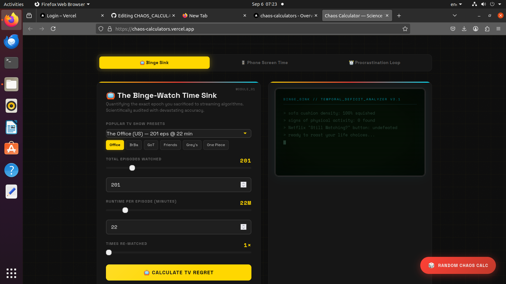
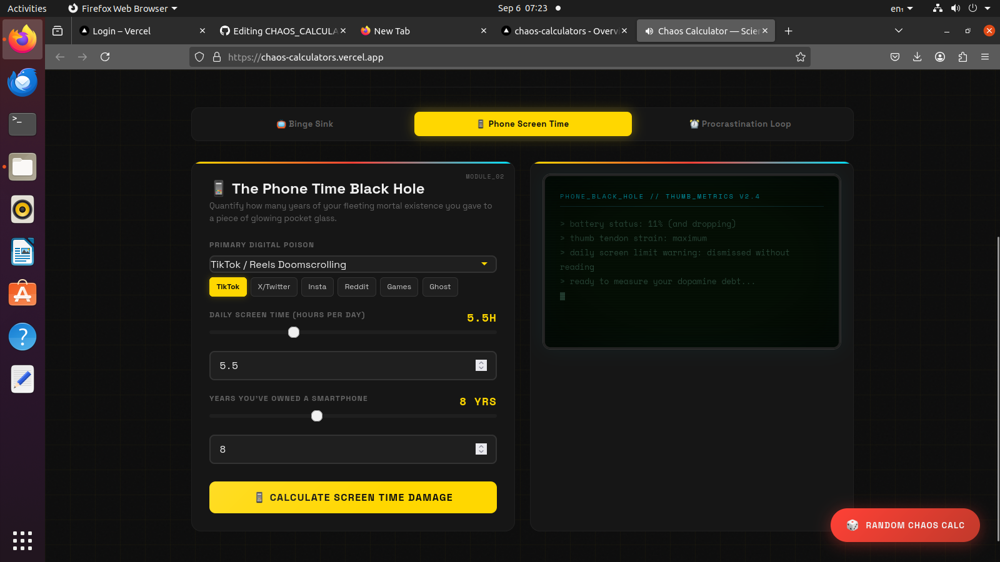

# Chaos calculator🎯

## Basic Details
### Team Name: calculator

### Team Members
- Team Lead: Devika Rojan - Viswajyothi college of engineering and technology
  

### Project Description
A funny calculator that calculates unnecessary things like phone screen time, episode watching time,prorastination time.

### The Problem (that doesn't exist)
We can understand how many of ypur life you have wasted doing thing.

### The Solution (that nobody asked for)
[I created a software to calculate time taken for episodes watching, phone screen time and feel regret of this

## Technical Details
### Technologies/Components Used
For Software:
- [Languages used] HTML , Javascript, CSS
- [Frameworks used]
- [Libraries used]
- [Tools used] Antigravity 

### Implementation
For Software:
# Installation
[commands]

# Run
[commands]

### Project Documentation
For Software:

# Screenshots (Add at least 3)

*Screenshot 1 – Chaos Calculator interface*

*Screenshot 2 – Phone screen time calculation*

*Screenshot 3 – Episode watching time calculation*

*Screenshot 4 – Procrastination time calculation*

### Project Demo
Project URL: https://chaos-calculators.vercel.app/

## Team Contributions
- [Name 1]: [Specific contributions]
- [Name 2]: [Specific contributions]
- [Name 3]: [Specific contributions]

---
Made with ❤️ at TinkerHub Useless Projects 

